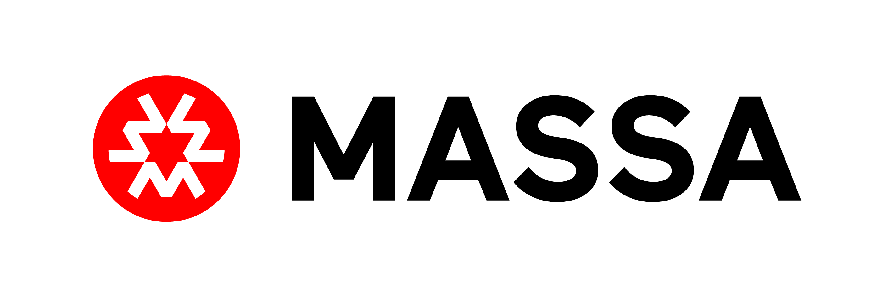

 

 

# Massa: The Decentralized and Scaled Blockchain

## About Massa

[Massa](https://massa.net) is a new blockchain based on a [multithreaded technology](https://arxiv.org/pdf/1803.09029)
that supports more than 10'000 transactions per second in a fully decentralized network with thousands of nodes. A short
introduction video is available [here](https://www.youtube.com/watch?v=NUUFhvd7ulY).

Massa's purpose is to make it easy to deploy fully decentralized applications. To achieve this purpose, Massa is the
first blockchain to provide [Autonomous smart contracts](https://docs.massa.net/en/latest/general-doc/autonomous-sc.html)
and native [front-end hosting](https://docs.massa.net/en/latest/general-doc/decentralized-web.html).

Here is a list of tools to easily build applications on the Massa blockchain:

- [JS Client library](https://github.com/massalabs/massa-web3) to connect to the Massa blockchain from your applications.
- [AssemblyScript](https://github.com/massalabs/massa-as-sdk) SDKs to write smart contracts.
- [Examples of applications](https://github.com/massalabs/massa-sc-examples) built on Massa.
- [Explorer](test.massa.net).
- [Interactive API specification](https://playground.open-rpc.org/?schemaUrl=https://test.massa.net/api/v2&uiSchema\[appBar\]\[ui:input\]=false&uiSchema\[appBar\]\[ui:inputPlaceholder\]=Enter+Massa+JSON-RPC+server+URL&uiSchema\[appBar\]\[ui:logoUrl\]=https://massa.net/favicons/favicon.ico&uiSchema\[appBar\]\[ui:splitView\]=false&uiSchema\[appBar\]\[ui:darkMode\]=false&uiSchema\[appBar\]\[ui:title\]=Massa&uiSchema\[appBar\]\[ui:examplesDropdown\]=false&uiSchema\[methods\]\[ui:defaultExpanded\]=false&uiSchema\[methods\]\[ui:methodPlugins\]=true&uiSchema\[params\]\[ui:defaultExpanded\]=false).
- [Lots of documentation](docs.massa.net), from [web3 development](https://docs.massa.net/en/latest/web3-dev/smart-contracts.html)
  to [Massa's architecture](https://docs.massa.net/en/latest/general-doc/architecture.html).

## Join the Testnet

As decentralization is our core value, we would like to help you start
and run a Massa node. You'll find a full tutorial on how to run a node on the testnet
[here](https://docs.massa.net/en/latest/testnet/install.html#testnet-install).

Running a node during the testnet phase also helps
us find bugs and improve usability, so it will be rewarded with real
Massa on mainnet launch.

## Community

If you have any questions regarding the project or wish to discuss technical aspects in more depth, feel free to reach
out to us in our community channels:

- [Discord](https://discord.com/invite/massa)
- [Telegram](https://t.me/massanetwork)
- [Twitter](https://twitter.com/MassaLabs)

## Contributing

We welcome contributions from community members. If you’d like to work on some issue, don’t hesitate to ask questions
and we’ll try to help you as soon as possible.

Issues tagged as "good first issue" are a great place to start. If you are unsure with how and where to start, feel free
to reach out to us on the [Discord](https://discord.com/invite/massa) discord.
