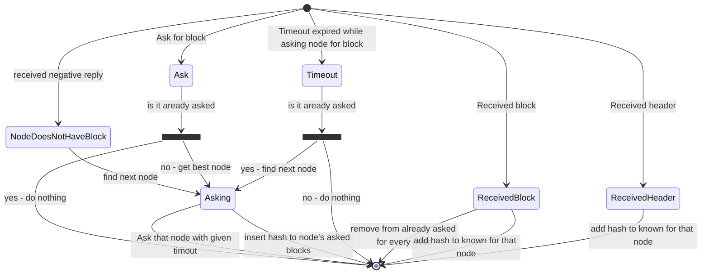
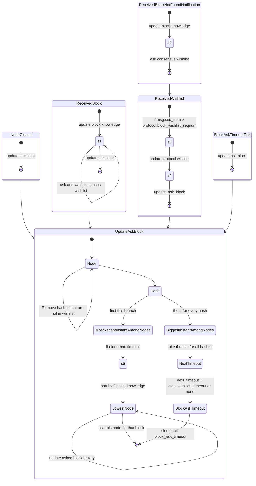

Here is a proposition for block asking workflow.

For every node we have a list of blocks that we asked to that node, with a sequence number,
and a wishlist of blocks that node asked us.
To get next node sort them by
* if we already asked that block to that node
* if that node knows about that block
* number of time we asked that block to that node
* something else in case of tie ?



When receiving a block from consensus for every node:
* if it is in node's wishlist, send it the full block
* if a node doesn't know about that block, send the header
* else do nothing

When a node ask us for a block:
* if we have it, send it
* else add it to node's wishlist, maybe ask it to someone else ?

What if a node ask us a block we consider stale, or invalid ?

```rust
struct NodeInfo {
    known_blocks: HashSet<Hash>,
    wanted_blocks: HashSet<Hash>,
    asked_blocks: HashMap<Hash, u64>,
}
```

## Second proposition


Needed structures:
* protocol_worker.wishlist
* protocol_worker.wishlist_seq_number

```rust
struct NodeInfo {
    known_blocks: HashMap<Hash, bool>,
    wanted_blocks: HashSet<Hash>,
    asked_block_history: HashMap<Hash, Option<Instant>
}
```