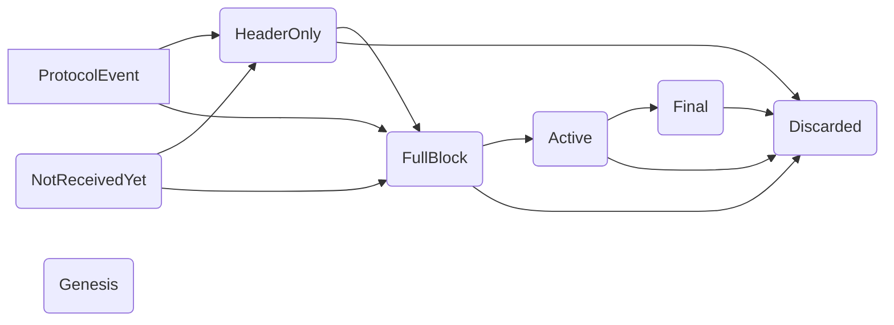

# Architecture idea for consensus blocks and headers management
WIP

## Introduction

The goal is to describe how data will be processed in consensus, and have a place to discuss what is possible.

We want to unify all existent data structures with blocks and/or headers inside one big hashmap. It will store `ConsensusBlock`s

```rust
struct BlockDatabase{
    blocks: HashMap<Hash, ConsensusBlock>,
    current_sequence_number: u64,
}

enum ConsensusBlock {
    NotReceivedYet(PendingAckBlockState)
    HeaderOnly(Header, PendingAckBlockState),
    FullBlock(Block, PendingAckBlockState),
    Discarded(Header, DiscardReason, u64), // u64 is a sequence number
    Genesis(Block),
    Active(CompiledBlock),
    Final(CompiledBlock),
}

struct PendingAckBlockState {
    i_am_waiting_for: HashSet<Hash>,
    they_are_waiting_for_me: HashSet<Hash>,
    slot: Slot,
    sequence_number: u64,
}
```

## Consensus worker tokio select loop

### Slot tick

* if it is our turn, create block and rec_acknowledge it
* loop on block_db.full_blocks().filter(|block| block.1.1_am_waiting_for.len()==0 and block.1.slot.is_in_the_present_enough()) and rec_acknowledge these blocks
* reset timer

### Protocol event
* ReceivedBlock
    * rec_acknoledge block
* Received blockHeader
    * check header (in block graph)
    * update PendingAckBlockState in block_db
* Received transaction
    * see milestone 0.3
* Get Block
    * just look in block_db

### Detailed methods and functions

#### rec_acknowledge block
* start with the block to acknowledge in to_ack hashmap
* while there is a next block to acknowledge
    * remove that block from to_ack
    * acknoledge block
    * extend to_ack with to retry blocks
* if there is a storage command sender, send it blocks that became final

#### acknowledge block in consensus worker
* check if already in block_db, update sequence_number if needed, or transition from HeaderOnly to FullBlock
* go to block graph acknowledge block
    * if it is now an active block
        * discard waiting blocks that are older than latest_final_blocks_periods
        * propagate block
        * unlock dependencies that were relying on that block -> a hash map of blocks to retry
    * else
        * update dependencies and future waiting blocks
        * or do nothing if the block is too much in the future
        * or discarded it if it was already discarded, has invalid fields, draw mismathc, invalid parents, too old
        * or return an error if crypto, time, consensus or container inconsistency error occured.
* return blocks we could retry and blocks that became final


#### acknowledge block in block graph
* check header
* if ok update_consensus_with_new_block
* return blocks to retry

#### update_consensus_with_new_block
* inherit incompatibilities from parents
* check thread incompatibility      |
* check grandpa incompatibility     | -> extend incompatibilies
* check operation incompatibilities |
* check if there is an incompatibility with a final block --> ToDiscardError
* promote to Active ConsensusBlock
* add incompatibilities to gi_head in both directions
* Update max_cliques
    * if there is more incompatibilities than those inherited from parents no need to re compute everything
* Computes cliques fitnesses and keep the best
* use it to update best parents
* list stale blocks and prune them
* list final blocks
* find the latest and update latest_final_blocks
* prune useless final blocks
* return pruned blocks' hashes and discarded final blocks

#### unlock dependencies

#### check header
* check if received header is in block database -> AlreadyKnownError
* (no structural checks needed)
* check that it is newer than the latest final block in that thread -> ToDiscardError
* check that it is not too far in the future (see future_block_processing_max_periods) -> ToDiscardError
* check roll number -> ToDiscardError
* check if time to process it has come (for now: is its slot in the past) -> InTheFutureError
* check dependencies
    * check that no parent is discarded
    * check if a parent is in the wrong thread or has a slot not strictly before the block
        * if a parent is discarded or there is some mess with slots and parents -> ToDIscardError
        * else keep missing dependencies
    * check that parents are mutually compatible -> ToDiscardError
    * check_block_parents_topological_order -> ToDiscardError
* return missing dependencies

#### check if received block is in block database
* it's NotReceivedYet
    * promote to FullBlock
    * can start acknowledgement process

* it's HeaderOnly
    * promote to FullBlock
    * check header
    * if it isn't waiting for anything else acknowledge block

* it's FullBlock
    * if it isn't waiting for anything else acknowledge block

* it's Active
    * do nothing

* it's Final
    * do nothing

* it's Discarded
    * update sequence number

* it's Genesis
    * Do something with the node that send that ?

#### check_block_parents_topological_order
Only difference with current implementation will be where we are looking for blocks.

#### check if received header is in block database

Same as check if received block is in block database, except if it was already just a header. In that case do nothing.

## Transitions between ConsensusBlock states


### into discarded
* promote into discarded block with given reason and curent_sequence_number
* increment current_sequence_number
* check how many Discarded are in block_db, if needed remove these with low sequence number.
* return definitively discarded blocks (we want to keep definitely discarded final blocks)

Do we need to remove blocks one by one ?

### into active
* for parents : update children vec
