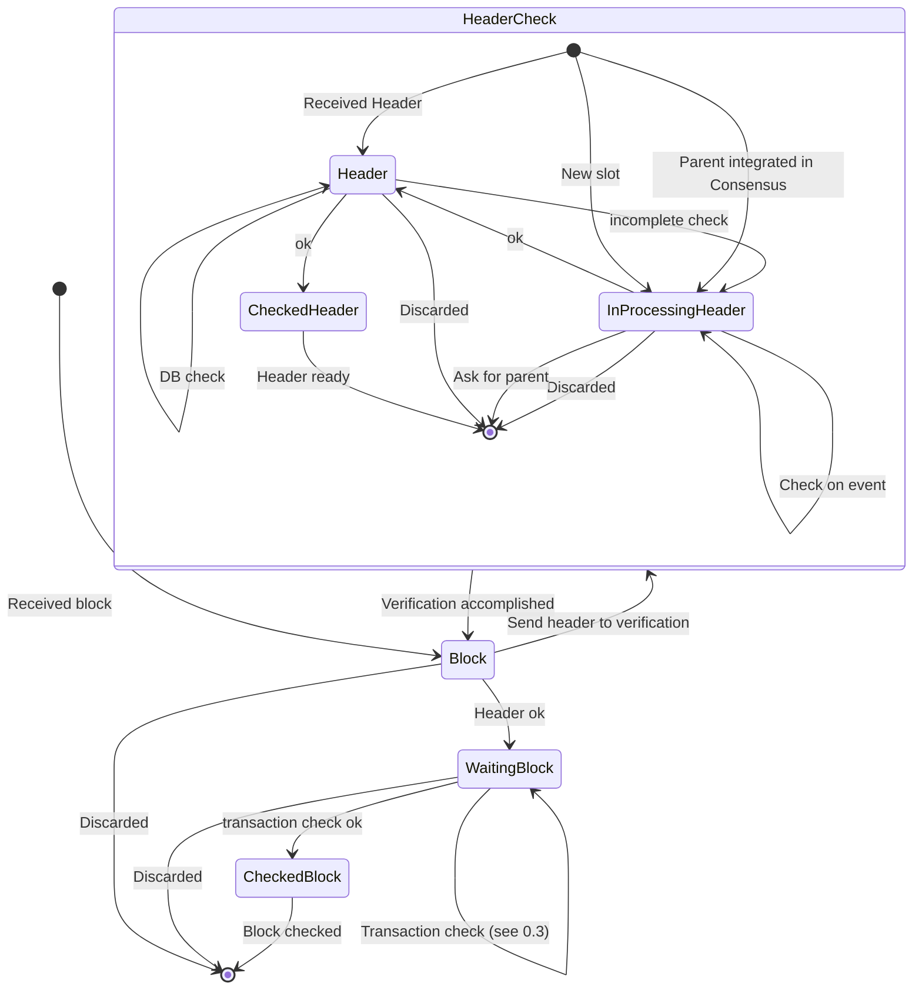

```mermaid
stateDiagram-v2

    state HeaderCheck{
        [*] --> Header: Received Header
        Header --> Header: DB check
        Header --> InProcessingHeader: incomplete check
        InProcessingHeader --> [*]: Discarded
        InProcessingHeader --> [*]: Ask for parent
        [*] --> InProcessingHeader: Parent integrated in Consensus
        [*] --> InProcessingHeader: New slot
        InProcessingHeader --> InProcessingHeader: Check on event
        InProcessingHeader --> Header: ok
        Header --> CheckedHeader: ok
        Header --> [*]: Discarded
        CheckedHeader --> [*]: Header ready
    }

    [*] --> Block: Received block
    Block --> HeaderCheck: Send header to verification
    HeaderCheck --> Block: Verification accomplished
    Block --> [*]: Discarded
    Block --> WaitingBlock: Header ok
    WaitingBlock --> WaitingBlock: Transaction check (see 0.3)
    WaitingBlock --> [*]: Discarded
    WaitingBlock --> CheckedBlock: transaction check ok
    CheckedBlock --> [*]: Block checked
```