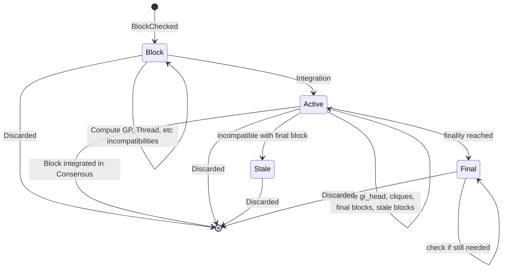

```mermaid
stateDiagram-v2
    [*] --> Block: BlockChecked
    Block --> Block: Compute GP, Thread, etc incompatibilities
    Block --> [*]: Discarded
    Block --> Active: Integration
    Active --> [*]: Block integrated in Consensus
    Active --> Active: Update gi_head, cliques, final blocks, stale blocks
    Active --> [*]: Discarded
    Active --> Final: finality reached
    Active --> Stale: incompatible with final block
    Stale --> [*]: Discarded
    Final --> Final: check if still needed
    Final --> [*]: Discarded
```