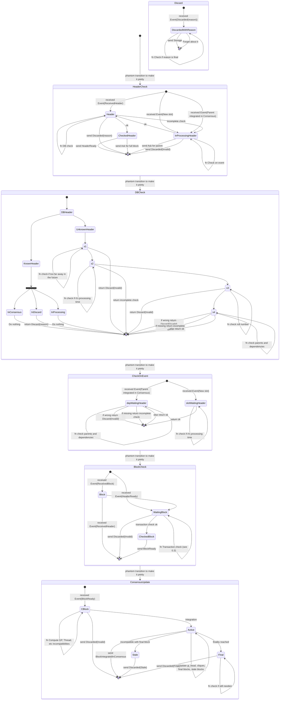

```mermaid
stateDiagram-v2
[*] --> HeaderCheck: phantom transition to make it pretty
HeaderCheck --> DBCheck: phantom transition to make it pretty
DBCheck --> CheckOnEvent: phantom transition to make it pretty
CheckOnEvent --> BlockCheck: phantom transition to make it pretty
BlockCheck --> ConsensusUpdate: phantom transition to make it pretty

    state HeaderCheck{
        [*] --> Header: received Event(ReceivedHeader)
        Header --> Header: fn DB check
        Header --> InProcessingHeader: incomplete check
        InProcessingHeader --> [*]: send Discarded(Invalid)
        InProcessingHeader --> [*]: send Ask for parent
        [*] --> InProcessingHeader: received Event(Parent integrated in Consensus)
        [*] --> InProcessingHeader: received Event(New slot)
        InProcessingHeader --> InProcessingHeader: fn Check on event
        InProcessingHeader --> Header: ok
        Header --> CheckedHeader: ok
        CheckedHeader --> [*]:send Ask for full block
        Header --> [*]: send Discarded(reason)
        CheckedHeader --> [*]: send HeaderReady
    }

state BlockCheck{    
    [*] --> Block: received Event(ReceivedBlock)
    Block --> [*]: received Event(ReceivedHeader)
    [*] --> WaitingBlock: received Event(HeaderReady)
    Block --> WaitingBlock
    WaitingBlock --> WaitingBlock: fn Transaction check (see 0.3)
    WaitingBlock --> [*]: send Discarded(Invalid)
    WaitingBlock --> CheckedBlock: transaction check ok
    CheckedBlock --> [*]: send BlockReady
}

state CheckOnEvent {
    [*] --> depWaitingHeader: received Event(Parent integrated in Consensus)
    [*] --> slotWaitingHeader: received Event(New slot)
    slotWaitingHeader --> slotWaitingHeader: fn check if it's processing time
    slotWaitingHeader --> [*]: return ok
    depWaitingHeader --> depWaitingHeader: fn check parents and dependencies
    depWaitingHeader --> [*]: if wrong return Discard(Invalid)
    depWaitingHeader --> [*]: if missing return incomplete check
    depWaitingHeader --> [*]: else return ok
}

state ConsensusUpdate  {
[*] --> CBlock: received Event(BlockReady)
    CBlock --> CBlock: fn Compute GP, Thread, etc incompatibilities
    CBlock --> [*]: send Discarded(Invalid)
    CBlock --> Active: Integration
    Active --> [*]: send BlockIntegratedInConsensus
    Active --> Active: fn Update gi_head, cliques, final blocks, stale blocks
    Active --> Final: finality reached
    Active --> Stale: incompatible with final block
    Stale --> [*]: send Discarded(Stale)
    Final --> Final: fn check if still needed
    Final --> [*]: send Discarded(Final)
}

state Discard {
    [*] --> DiscardedWithReason: received Event(Discarded(reason))
    DiscardedWithReason --> DiscardedWithReason: fn Check if reason is final
    DiscardedWithReason --> [*]: send Storage
    DiscardedWithReason --> [*]: Forget about it
}

state DBCheck {
    [*] --> DBHeader
    DBHeader --> KnownHeader
    DBHeader --> UnknownHeader
    state fork_state <<fork>>
    KnownHeader --> fork_state
    fork_state --> InConsensus
    fork_state --> InDiscard
    fork_state --> InProcessing
    InConsensus --> [*]: Do nothing
    InDiscard --> [*]: return Discard(reason)
    InProcessing --> [*]: Do nothing
    UnknownHeader --> s1
    s1 --> s1: fn check if too far away in the future
    s1 --> [*]: return Discard(Invalid)
    s1 --> s2
    s2 --> s2: fn check if it's processing time
    s2 --> [*]: return incomplete check
    s2 --> s3
    s3 --> s3: fn check roll number
    s3 --> [*]: return Discard(Invalid)
    s3 --> s4
    s4 --> s4: fn check parents and dependencies
    s4 --> [*]: if wrong return Discard(Invalid)
    s4 --> [*]: if missing return incomplete check
    s4 --> [*]: else return ok
}
```