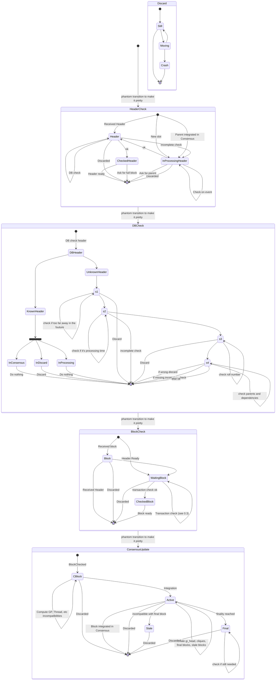

```mermaid
stateDiagram-v2
[*] --> HeaderCheck: phantom transition to make it pretty
HeaderCheck --> DBCheck: phantom transition to make it pretty
DBCheck --> BlockCheck: phantom transition to make it pretty
BlockCheck --> ConsensusUpdate: phantom transition to make it pretty

    state HeaderCheck{
        [*] --> Header: Received Header
        Header --> Header: DB check
        Header --> InProcessingHeader: incomplete check
        InProcessingHeader --> [*]: Discarded
        InProcessingHeader --> [*]: Ask for parent
        [*] --> InProcessingHeader: Parent integrated in Consensus
        [*] --> InProcessingHeader: New slot
        InProcessingHeader --> InProcessingHeader: Check on event
        InProcessingHeader --> Header: ok
        Header --> CheckedHeader: ok
        CheckedHeader --> [*]: Ask for full block
        Header --> [*]: Discarded
        CheckedHeader --> [*]: Header ready
    }

state BlockCheck{    
    [*] --> Block: Received block
    Block --> [*]: Received Header
    Block --> [*]: Discarded
    [*] --> WaitingBlock: Header Ready
    Block --> WaitingBlock
    WaitingBlock --> WaitingBlock: Transaction check (see 0.3)
    WaitingBlock --> [*]: Discarded
    WaitingBlock --> CheckedBlock: transaction check ok
    CheckedBlock --> [*]: Block ready
}

state ConsensusUpdate  {
[*] --> CBlock: BlockChecked
    CBlock --> CBlock: Compute GP, Thread, etc incompatibilities
    CBlock --> [*]: Discarded
    CBlock --> Active: Integration
    Active --> [*]: Block integrated in Consensus
    Active --> Active: Update gi_head, cliques, final blocks, stale blocks
    Active --> [*]: Discarded 
    Active --> Final: finality reached
    Active --> Stale: incompatible with final block
    Stale --> [*]: Discarded
    Final --> Final: check if still needed
    Final --> [*]: Discarded
}

state Discard {
    [*] --> Still
    Still --> [*]
    Still --> Moving
    Moving --> Still
    Moving --> Crash
    Crash --> [*]
}

state DBCheck {
    [*] --> DBHeader: DB check header
    DBHeader --> KnownHeader
    DBHeader --> UnknownHeader
    state fork_state <<fork>>
    KnownHeader --> fork_state
    fork_state --> InConsensus
    fork_state --> InDiscard
    fork_state --> InProcessing
    InConsensus --> [*]: Do nothing
    InDiscard --> [*]: Discard
    InProcessing --> [*]: Do nothing
    UnknownHeader --> s1
    s1 --> s1: check if too far away in the fuuture
    s1 --> [*]: Discard
    s1 --> s2
    s2 --> s2: check if it's processing time
    s2 --> [*]: incomplete check
    s2 --> s3
    s3 --> s3: check roll number
    s3 --> [*]: Discard
    s3 --> s4
    s4 --> s4: check parents and dependencies
    s4 --> [*]: if wrong discard
    s4 --> [*]: if missing incomplete check
    s4 --> [*]: else ok
}
```