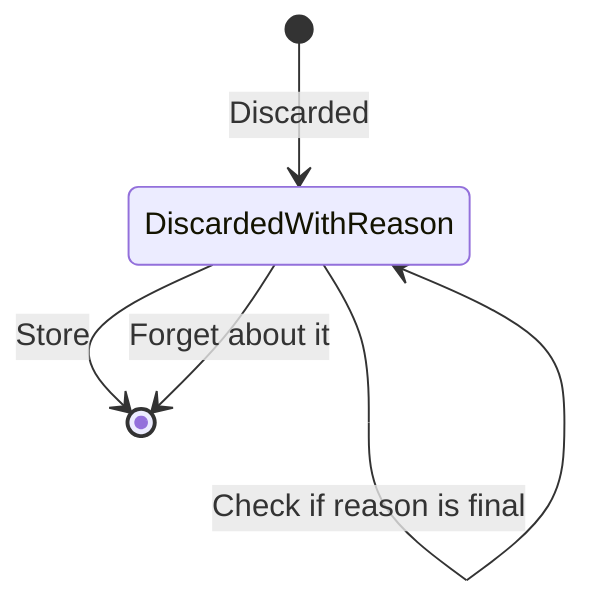

```mermaid
stateDiagram-v2
    [*] --> DiscardedWithReason: Discarded
    DiscardedWithReason --> DiscardedWithReason: Check if reason is final
    DiscardedWithReason --> [*]: Store
    DiscardedWithReason --> [*]: Forget about it
```