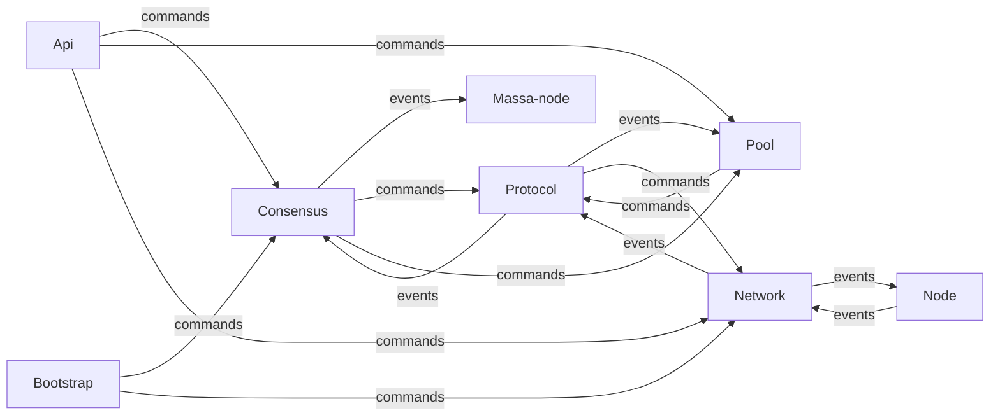

# Concurrency

The Massa system is built mostly around message-passing. This involves
bi-directional communication between components on bounded channels,
which comes with a risk of deadlock. To manage this risk, a distinction
is made between two types of messages:

- Events
    - Examples are: `NetworkEvent`, and `ProtocolEvent`. These are
        messages that can be dropped if they haven't been received, or
        added to the channel buffer, before a timeout. Care should be
        taken to ensure that dropping one of these does not result in
        livelock.
- Commands
    - Examples are: `ProtocolCommand` and `NetworkCommand`. Those
        cannot be dropped.

## How is deadlock prevented?

When two components communicate with each other, one of these channels
should be using `_Command` type of messages, and the other `_Event`.
This ensures that if both channels are full, `_Event` messages will
start being dropped, ensuring that the `_Command` messages are handled
and the system does not deadlock.

## What risks are left?

First, dropping `_Event` messages could inadvertently result in the
system not being able to make progress, a so-called livelock. Secondly,
care should be taken not to introduce dependencies on `_Command` type of
messages between components, even indirectly. For example, two
components should not send each other `_Command`, not even indirectly
via another, or multiple other, component(s).

## Current state of communication links

- Massa-node:
    - Receives events from:
        - Api
        - Consensus
- Consensus:
    - Sends events to:
        - Massa-node
    - Receives events from:
        - Protocol
    - Sends commands to:
        - Protocol
        - Pool
    - Receives commands from:
        - Bootstrap
        - Api
- Pool:
    - Receives events from:
        - Protocol
    - Sends commands to:
        - Protocol
    - Receives commands from:
        - Consensus
        - Api
- Protocol:
    - Sends events to:
        - Consensus
        - Pool
    - Receives events from:
        - Network
    - Sends commands to:
        - Network
    - Receives commands from:
        - Consensus
        - Pool
- Network:
    - Sends events to:
        - Protocol
        - Node
    - Receives events from:
        - Node
    - Receives commands from:
        - Protocol
        - Bootstrap
        - Api
- API:
    - Sends commands to:
        - Consensus
        - Pool
        - Network

## Blocking relationships

If a component has a relationship with another by sending `_Command`
type of messages than the receiving component cannot block on the
sender, which means that it cannot send `_Command` type of messages to
it, even indirectly via another, or several other, component(s).

- Network cannot block on Protocol, Bootstrap, and Massa-node, blocks
    on Node(s).
- Protocol cannot block on Consensus and Pool, blocks on Network.
- Pool cannot block on Consensus and Massa-node, blocks on Protocol.
- Consensus cannot block on Bootstrap and Massa-node, blocks on
    Protocol, Pool.
- API blocks on Massa-node.
- Massa-node cannot block on API, blocks on Consensus, Pool, and
    Network.
