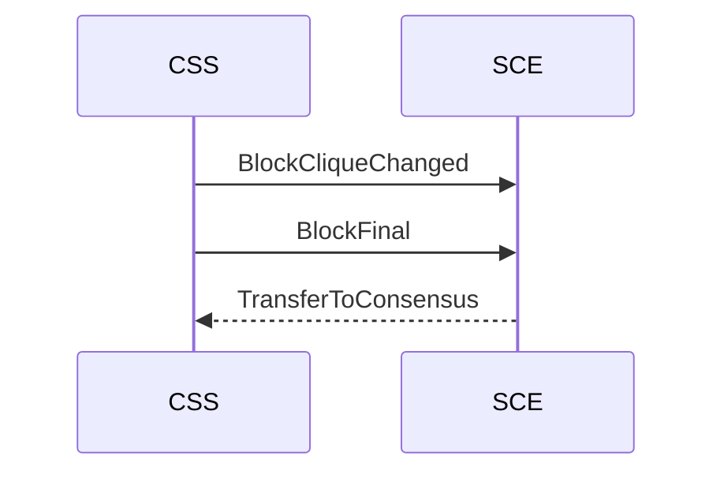
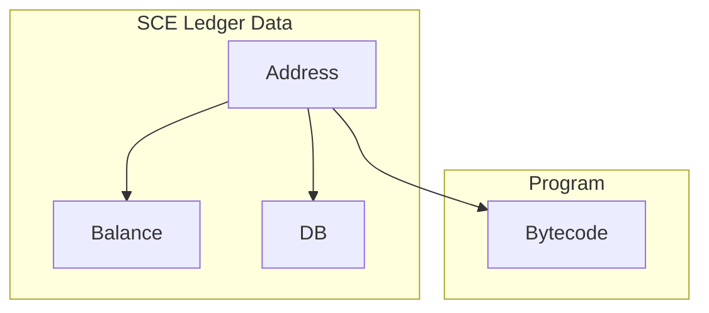

# Smart contracts

## Smart Contract Engine

### Rationale

The smart contract engine (SCE) is decoupled from the consensus system (CSS); they maintain separate ledgers: the SCE ledger and the CSS ledger.

The CSS informs the SCE whenever a block becomes CSS-final, and whenever the blockclique changes in any way.

The SCE executes the blockclique operations after sorting them by increasing block slot: this provides an absolute order of execution.

A special feedback loop is required to send coins from the SCE to the CSS.

A unit of "gas" represents a unit of computational cost. Different instructions might cost different amounts of gas.

### The ExecuteSC operation

The following new operation type is defined:

```rust
OperationType::ExecuteSC {
    max_gas: u32,
    gas_price: Amount,
    coins: Amount,
    bytecode: Vec<u8>,
}
```

Where:
* `bytecode` is smart contract bytecode that is understood by the SCE but not the CSS
* `max_gas` is the maximum amount of gas that the execution of `bytecode` is allowed to cost
* `gas_price` is the price per unit of gas that the caller is willing to pay for the execution
* `coins` are extra coins that are spent by tge CSS and are available in the execution context of `bytecode`

Blocks that include ExecuteSC operations must respect the following criteria, or else they are invalid:
* ExecuteSC spends `max_gas * gas_price + coins` from the sender address in the CSS ledger, which must therefore be available
* all ExecuteSC operations included in the block must be ordered by decreasing `gas_price`
* the sum of the max_gas values of all ExecuteSC operations in the block must not be higher than a protocol constant `max_block_gas`

When included in a block, from the CSS point of view, an ExecuteSC operation will only spend `max_gas * gas_price + coins` coins from the sender address and do nothing else.

When observing an ExecuteSC operation, the SCE will:
* if any of the following steps fail, the bytecode is not executed and all its changes to the SCE ledger are rollbacked. The sender loses `max_gas * gas_price + coins`.
* parse `bytecode` as smart contract bytecode
* execute the bytecode in `bytecode`:
  * if hard config-defined engine resource limits are hit (e.g. too much RAM used), execution fails
  * if the execution gas usage exceeds `max_gas` (defined inside the ExecuteSC operation call), execution fails

### SCE/CSS pipeline

The SCE and CSS modules are separate.

There is a FIFO message pipe from the CSS to the SCE, and another from the SCE to the CSS. 



Whenever the blockclique changes in any way, the CSS notifies the SCE of all the blocks of the current blockclique using the `BlockCliqueChanged(BlockHashMap<Block>)` message.
Note that this behevior is "theoretical" and will be optimized to avoid sending/recomputing everything at every blockclique change.
Possible optimizations include caching, checkpointing, incremental updates, etc... but are beyond the scope of this document.

Whenever some blocks become final, the CSS notifies the SCE of all new final blocks of using the `BlocksFinal(BlockHashMap<Block>)` message.

The SCE locally maintains a Final SCE ledger and a Candidate SCE ledger.
Addresses in the CSS ledger are also part of the SCE ledgers.
Smart-contract specific addresses are also part of the SCE ledger (but not CSS ledgers).

When an SCE block execution requests a coin transfer form the SCE ledger to the CSS ledger, a `TransferToConsensus{target_addr: Address, origin_slot: Slot, amount: Amount}` message is sent from the SCE to the CSS.
`origin_slot` is the slot of the block causing the `TransferToConsensus`.

When the SCE receives a `BlockCliqueChanged` message:
* the SCE reset its Candidate SCE ledger to the Final SCE ledger
* the SCE sorts all blockclique blocks by increasing slot
* for each block B in that order, the SCE processes the ExecuteSC operations in the block in the order they appear in the block. For each such operation `op`:
  * credit the block creator in the SCE ledger with `op.max_gas * op.gas_price`
  * execute the smart contract bytecode (rollback and ignore in case of failure, but to not reimburse gas fees)
    
When the SCE receives a `BlocksFinal` message:
* this message notifies the SCE about new CSS-final blocks
* a slot is SCE-final if its immediate predecessor slot contains a block that is CSS-final or is empty but followed in its own thread by a CSS-final block. This ensures that no new block executions can be inserted in-between existing final block executions in the SCE

When a block B becomes SCE-final:
* update the Final SCE ledger by VM-executing the newly SCE-final block on top of the current Final SCE ledger 
* if the block B requires transferring coins from the SCE ledger to the CSS ledeger, send a TransferToConsensus to the CSS:
  * fields:
    * target_addr = the emitter of the operation that caused the TransferToConsensus
    * origin_slot = the slot of the SCE-final block causing the TransferToConsensus
    * amount = amount of coins to transfer
  * this will cause the spending of "amount" coins on the SCE side

When the CSS receives a TransferToConsensus message:
* it registers that `target_addr` needs to be credited of `amount` coins in the CSS ledger at slot `target_slot = origin_slot + 1 period`
* the credit is performed at the beginning of the first block that comes at `target_slot` (or later in case of misses)


### Structure of the SCE




* Holds separate Final and Candidate SCE ledgers, that match each address to a balance, database, and program area
  * the `database` is a key-value map where the key is a sha256 hash, and the value contains arbitrary bytes
  * the `program` area contains bytecode with decorated public/private functions
* Contains an execution engine that will be fed the sorted and ExecuteSC operations with the block they belong to:
  * Bytecode is interpreted as WASM and executed
  * massa-specific "systcalls" are made available to the execution engine
  * the execution engine is fully deterministic
  * the execution engine measures and limits resource and gas usage during realtime during bytecode execution

* the SCE ledger is basically a `HashMap<Address, SCELedgerEntry>` where SCELedgerEntry has the fields:
  * sce_balance: `Amount`
  * database: `HashMap<Hash, Vec<u8>>`
  * program_data: `Vec<u8>` // to be better defined in followup issues

### SCE WASM execution engine syscalls

A smart-contract will be able to call into Massa-specific API's, providing by the "Massa runtime".
We could use "host functions" in wasmer to provide these API's to a running contract. See https://gitlab.com/massalabs/massa/-/issues/360

Available "syscalls":

- `Call(SC_addr, function_name, parameters)`: synchronously calls a function in the same, or another smart contract
- `TransferToConsensus(amount)`: transfers massa coins from SCE ledger to the consensus ledger. On the SCE side, this just burns the coins.
- `WriteDatabase(key, value)`: writes in the database of the current smart contract
- `ReadDatabase(SC_addr, key)`: reads a value from an arbitrary database
- `GetContext -> Context`: returns the call context (block, stack, available coins, max_gas, etc...)
- `NewSC(balance, data, program) -> SC_addr` : creates a new smart contract with initial balance, data and program. Returns its automatically generated address (SCE ledger) on success.

## Smart contract usage

### A python example

```python
# main code sc.py

import massa

@export_smart_contract_function
def resolve_domain(name):
    db = massa.db.open(
        massa.context.sc_addr  # address of the current smart contract
    )
    # here, db is available for read AND write because we opened the db of the current SC,
    # otherwise it would be read-only
    resolved_addr = db.get(massa.hash(name))
    if resolved_addr is None:
        return None
    return resolved_addr
    

@export_smart_contract_function
def register_domain(name, address):
    if resolve_domain(name) is not None:
        raise ValueError("domain already registered") 
    db = massa.db.open(massa.context.sc_addr)
    db.insert(massa.hash(name), address)

""" how to deploy:

compile_python_sc sc.py
this tool will:
    * compile the python into PYC bytecode
    * output a WASM program (sc.wasm) that looks like this:
      call_remote_sc [address of the python bytecode interpreter smart contract] [PYC bytecode]

then, we can call using the client:
    register_new_smart_contract sc.wasm [wallet_address] [max_gas] [gas_price] [inclusion_fee] [initial_coins]
    >>> output = error, or smart contract address on success
this command will:
    * turn a wasm smart contract into an ExecuteSC operation where the payload bytes are a wasm program that looks like this:
      register_new_smart_contract [content of sc.wasm] [initial_coins]
    * send that operation


When we want to use the resolver in another program:    
    
"""

import massa
import my_resolver

resolved_addr = my_resolver.resolve("test.com")
# this effectively does the following (hidden in the my_resolver include):
# sc = massa.sc.open(RESOLVER_SC_ADDRESS)
# return sc.exports.resolve_domain(domain_string)
```
