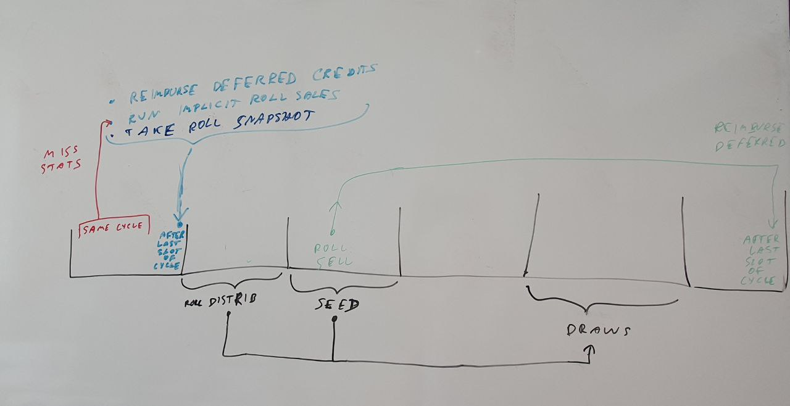

# Ledger unification

## General idea

Currently, there are two ledgers: the old sequential (sled) ledger managed by the consensus module, and the new massa-ledger (rocks db) managed by the execution module.
The goal here is to move the management of both ledgers into the execution module, and simplify consensus.

## Changes

* protocol should still verify operation signatures (invalidates block)
* consensus should still verify operation reuse (invalidates block)
* consensus should not check that operations execute properly anymore
* operation execution can fail but sequential balance fees will always be credited to the block producer 

## Proof-of-Stake

### Overview

* draws at cycle C are generated using the seed from cycle C-2 and roll distribution from cycle C-3
* after its last slot of a cycle C is executed:
  * miss stats from cycle C trigger implicit roll sales
  * deferred credits are reimbursed
  * a snapshot of the roll distribution is taken for this cycle
* in case of roll sell at cycle C, the roll is removed and a deferred credit is registered for cycle C+3 to reimburse the cost of the roll after a lock cycle
* in case of slashing, both rolls and deferred credits can be slashed



### Final PoS state in massa-final-state

```rust
struct PoSFinalState {
  /// contiguous cycle history. Front = newest.
  cycle_history: VecDeque<CycleInfo>,

  /// latest final slot
  last_final_slot: Slot

  /// coins to be credited at the end of the slot
  deferred_credits: Map<Slot, Map<Address, Amount>>
}

struct CycleInfo {
  /// cycle number
  cycle: u64,
  
  /// whether the cycle is complete (all slots final)
  complete: bool,

  /// number of rolls each staking address has
  roll_counts: BTreeMap<Address, u64>,

  /// random seed bits of all slots in the cycle so far
  rng_seed: BitVec<Lsb0, u8>,

  /// Per-address production statistics
  production_stats: Map<Address, ProductionStats>,
}

struct ProductionStats {
  block_success_count: u64,
  block_failure_count: u64,
}
```

The `cycle_history` contains consecutive cycle stats, keeping the oldest one still needed in the `back()`, and the highest one needed in the `front()`.

### PoS changes

```rust
struct PoSChanges {
  /// extra block seed bits added
  seed_bits: BitVec<Lsb0, u8>,

  /// new roll counts for addresses (can be 0 to remove the address from the registry)
  roll_changes: Map<Address, u64>

  /// updated production statistics
  production_stats: ProductionStats

  /// set deferred credits indexed by target slot (can be set to 0 to cancel some, in case of slash)
  /// ordered structure to ensure slot iteration order is deterministic
  deferred_credits: BTreeMap<Slot, Map<Address, Amount>>,
}
```

`PoSFinalState` exposes a `settle_slot(&mut self, S: Slot, changes: &PoSChanges)` method that finalizes changes at a slot S (cycle C):
* set self.last_final_slot = C
* if cycle C is absent from self.cycle_history:
  * push a new empty CycleInfo at the back of self.cycle_history and set its cycle = C
  * pop_front from cycle_history until front() represents cycle C-4 or later (not C-3 because we might need older endorsement draws on the limit between 2 cycles)
* for the cycle C entry of cycle_history:
  * extend seed_bits with changes.seed_bits
  * extend roll_counts with changes.roll_changes
    * delete all entries from roll_counts for which the roll count is zero
  * add each element of changes.production_stats to the cycle's production_stats
* for each changes.deferred_credits targeting cycle Ct:
  * overwrite self.deferred_credits entries of cycle Ct in cycle_history with the ones from change
    * remove entries for which Amount = 0
* if slot S was the last of cycle C:
  * set complete=true for cycle C in the history
  * compute the seed hash and notifies the `Selector` for cycle C+3

### Selector

The `Selector` system is shared through an RwLock to many modules.

It efficiently draws PoS selections in separate threads to not block the execution thread that feeds it with seed hashes and roll distributions.

It stores the draws once they are available.
If a module asks Selector for a draw that was discarded (too old) or not computed yet, it returns the corresponding error.

This module computes draws in a multithreaded way using Xoshiro256++ jumps https://docs.rs/rand_xoshiro/latest/rand_xoshiro/struct.Xoshiro256PlusPlus.html#method.jump

### Speculative PoS changes

In the speculative execution history, each element has a PoSChanges.

Possible lazy speculative queries:
* get roll count for a given address
  * used to check roll counts when buying a roll
  * used to set the absolute roll count in case of slashing (read the old state)
* list of all deferred credits for a given address after a certain slot
  * used to apply penalties by setting the new deferred credit (read the current incoming ones)
* list of all deferred credits for a given slot
  * used to apply the credits after the last slot of every cycle
* get prod stats to decide on implicit roll sales immediately after the last slot of a cycle


Speculative execution of a slot S of cycle C:
* create a `new_pos_changes: PoSChanges::default()`
* execute async calls
* if there is no block in slot S:
  * speculatively increment `new_pos_changes.production_stats.block_failure_count += 1`
  * hash the slot and speculatively push the first bit of the hash into `new_pos_changes.seed_bits`
* if there is a block at slot S:
  * speculatively increment `new_pos_changes.production_stats.block_success_count += 1`
  * speculatively push the first bit of the block hash into `new_pos_changes.seed_bits`
  * at every RollBuy operation:
    * lazily query the sequential balance of the address and check if it has enough coins to buy the rolls
    * speculatively spend the right amount from the buyer's sequential balance in the ledger
    * speculatively query the current amount of rolls the buyer has
    * speculatively add the bought rolls to new_pos_changes
  * at every RollSell operation:
    * speculatively query the current amount of rolls the seller has and check if it has enough to sell
    * speculatively remove the sold rolls inside new_pos_changes
    * speculatively add the reimbursement into deferred_credits for the end of the last slot of cycle C + 3
  * at every denunciation (penalty = 1 roll):
    * speculatively query the current amount of rolls the offender has
    * speculatively remove the slashed roll inside new_pos_changes
    * if the slashing could not slash a roll:
      * speculatively slash roll_price coins from deferred_credits going from the lowest to the highest slot until the full remaining penalty amount is slashed. This prevents an attacker from launching a roll sell, then attacking, then being reimbursed.
* speculatively credit coins from all deferred credits targeting the end of slot S
* if S was the last slot of cycle C:
  * if the speculative production stats of an address are not satisfactory (> 70% miss):
    * speculatively remove all rolls of the address in new_pos_changes
    * schedule a full coin reimbursement for the end of the last slot of cycle C + 3


 When a speculatively executed slot S finalizes (SCE finality), apply the PoSChanges from its ExecutionResult to the PoS final state.


