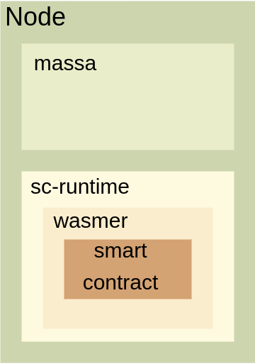

Introduction
============

A smart contract is a transaction protocol used to be sure that an operation, involving different stakeholders, is executed as expected.

Having trust between stakeholders is not necessary, as long as each participant is trusting the transaction protocol.                                                                                                                                                                                               

By adding a programmable mechanism to the blockchain, we get such a protocol as long as the program has the following characteristics:

- Immutability
- Determinism
- Audit

.. note::
   Smart contract is not about replacing paper contract with electronic one, but 
   replacing the Law with the transaction protocol.
   By doing so you're also replacing trust in justice by trust in the blockchain.
                                                                                                                                                                                                            
In the following, and in the crypto ecosystem, we talk about smart contracts only to refer to a *program* that can be executed on a blockchain.

Nevertheless, it's important to keep in mind that the transaction protocol exists and is valued only thanks to the entanglement of the program in the blockchain and its guarantees.
                                                                                                                                                                                                           
                                                                                                                                                                                                            
Technical choices                                                                                                                                                                      
^^^^^^^^^^^^^^^^^                                                                                                                                                                      

For all the reasons listed above and for performance, Massa chose a program in WebAssembly.

For the sake of accessibility, Massa decided to use AssemblyScript as programming language to compile the expected logic into bytecode.             

Finally, at node level, the byte of a program is executed by Wasmer.

The following schema recap graphically all this:

