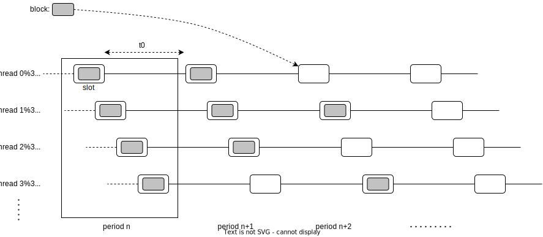
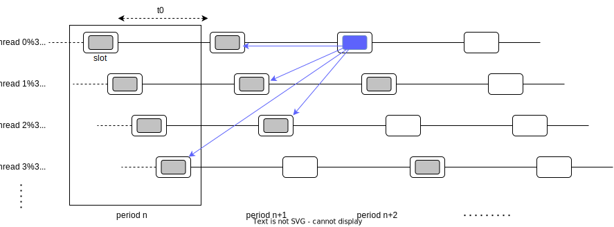
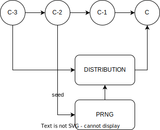
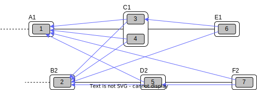
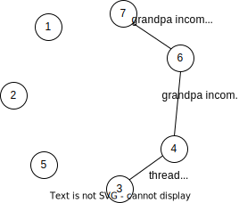

Introduction
============

We will describe in this document the global architecture of a Massa Node, from the ground up, and introduce relevant definitions and concepts.

The goal of the Massa network is to build a consensus between nodes to gather, order and execute **operations**, whose ultimate purpose is to act as transitions for the global network state, called the **ledger**. Some operations are produced by external clients and sent to the Massa network via a **node**. Some operations are produced internally by nodes executing **smart contracts**. Nodes will gather all the pending operations and group them inside **blocks**, containing a finite set of operations and which are continuously constructed as new operations become available. This is generally how blockchain protocols are organized, but unlike traditional blockchains, Massa blocks are not simply chained one after the other, but organized into a more complex spatio-temporal structure. 

Instead of one chain, there are several threads (T=32) of chains running in parallel, with blocks equally spread on each thread over time, and stored inside **slots** that are spaced at fixed time intervals:

The time between two slots located on the same thread is called a **period** and lasts 16s (conventionally called :math:`t_0`). Corresponding slots in threads are slightly shifted in time relative to one another, by one period divided by the number of threads, which is 16s/32 = 0.5s, so that a period contains exactly 32 slots equally spaced over the 32 threads. A **cycle** is defined as the succession of 128 periods and so lasts a bit more than 34min. Periods are numbered by increments of one, so can be used together with a thread number to uniquely identify a block slot. Period 0 is the genesis and contains genesis blocks with no parents.

The job of the Massa nodes network is to essentially collectively fill up slots with valid blocks. To do so, at each interval of 0.5s, a specific node in the network is elected to be allowed to create a block (more about the selection process below, and the proof of stake sybil resistance mechanism), and will be rewarded if it creates a valid block in time. It is also possible that a node misses its opportunity to create the block, in which case the slot will remain empty (this is called a **block miss**).

In traditional blockchains, blocks are simply referencing their unique parent, forming a chain. In the case of Massa, each block is referencing one parent block in each thread (so, 32 parents). Here is an example illustrated with one particular block:

Let's introduce some relevant definitions and concepts generally necessary to understand how the Massa network operates. We will then explain the node architecture and how the whole system works.

Address
*******

Each account in Massa has a public and private key associated with it. This is how messages can be signed
and identity enforced. 

The address of an account is simply the hash of its public key.

Ledger
******

The ledger is a map that stores a global mapping between addresses and information related to these addresses. It is replicated in each node and the consensus building mechanism ensures that it converges towards a consistent value over the whole network. The ledger is the state of the Massa network, and fundamentally operations (see below) are requests to modify the ledger.

The information stored in the ledger with each address is the following:

===============================  =========================================================
**Ledger information associated with each address**       
------------------------------------------------------------------------------------------ 
``balance``                      The amount of Massa coins owned by the address              
``bytecode``                     When the address references a smart contract, this is the compiled code
                                 corresponding to the smart contract (typically contains several functions that act as API entry points for the smart contract)        
``datastore``                    A key/value map that can store any persistent data related to a smart 
                                 contract, its variables, etc                                     
===============================  =========================================================

Smart Contract
**************

Smart contracts are a piece of code that can be run inside the Massa virtual machine and which can modify the ledger, accept incoming requests through a public API, and also react to or emit events. One particularity of Massa smart contracts compared to other blockchain smart contracts is their ability to wake up by themselves independently of an exterior request on their API. This allows more autonomy and less dependency on external centralized services.

Smart contracts are currently written in assemblyscript, a stricter derivation from typescript, which is itself a type-safe version of javascript. AssemblyScript compiles to web assembly bytecode (wasm). Massa nodes Execution Module runs such bytecode. Smart contracts have access to their own datastore, so can modify the ledger and the network state. 

Operation
*********

Fundamentally, the point of the Massa network is to gather, order and execute operations, recorded inside blocks that are located in slots. There are three types of operations: transactions, roll operations, and smart contract code execution. The general structure of an operation is the following, and the different types of operations differ by their payload:

===============================  =========================================================
**Operation header**       
------------------------------------------------------------------------------------------ 
``creator_public_key``           The public key of the operation creator (64 bytes)               
``expiration_period``            Period P after which the operation is expired        
``max_gas``                      The maximum gas spendable for this operation         
``fee``                          The amount of fees the creator is willing to pay     
``payload``                      The content of the operation (see below)            
``signature``                    signature of all the above with the private key of    
                                 the operation creator                                
===============================  =========================================================

Transactions operations
^^^^^^^^^^^^^^^^^^^^^^^

Transactions are operations that move native Massa coins between addresses. Here is the corresponding payload:

===============================  =========================================================
**Transaction payload**       
------------------------------------------------------------------------------------------ 
``amount``                       The amount of coins to transfer              
``destination_address``          The address of the recipient                        
===============================  =========================================================

Buy/Sell Rolls operations
^^^^^^^^^^^^^^^^^^^^^^^^^

Rolls are staking tokens that participants can buy or sell with native coins (more about staking below). This is done via special operations, with a simple payload:

===============================  =========================================================
**Roll buy/sell payload**       
------------------------------------------------------------------------------------------ 
``nb_of_rolls``                  The number of rolls to buy or to sell              
===============================  =========================================================

Smart Contract operations
^^^^^^^^^^^^^^^^^^^^^^^^^

Smart Contracts are pieces of code that can be run inside the Massa virtual machine. There are two ways of calling for the execution of code:

1. Direct execution of bytecode

In this case, the code is provided in the operation payload and executed directly:

===============================  =========================================================
**Execute SC payload**       
------------------------------------------------------------------------------------------ 
``bytecode``                     The bytecode to run (in the context of the caller address)              
===============================  =========================================================

1. Smart Contract function call

Here, the code is indirectly called via the call to an existing smart contract function, together with the required parameters:

===============================  =========================================================
**Call SC**       
------------------------------------------------------------------------------------------ 
``target_address``               The address of the targeted smart contract
``target_fun``                   The function that is called              
``params``                       The parameters of the function call              
===============================  =========================================================

Block
*****

A block is a data structure built by nodes and its function it to aggregate several operations. As explained above, for each new slot that becomes active, a particular node in the network is elected in a deterministic way with the task of creating the block that will be stored in that slot (more about this in the description of the Selector Module below). A block from a given thread can only contain operations originating from a creator_public_key whose hash's five first bits designate the corresponding thread, thus implicitly avoiding collisions in operations integrated into parallel threads.

The content of a block is as follows:

===============================  =========================================================
**Block header**       
------------------------------------------------------------------------------------------ 
``slot``                         A description of the block slot, defined by a couple (period, thread) that 
                                 uniquely identify it
``creator_public_key``           The public key of the block creator (64 bytes)           
``parents``                      A list of the 32 parents of the block, one parent per thread (parent blocks are 
                                 identified by the block hash)        
``endorsements``                 A list of the 9 endorsements for the block (more about endorsements below)
``operations_hash``              A hash of all the operations included in the block (=hash of the block body below)
``signature``                    signature of all the above with the private key of    
                                 the block creator                               
**Block body**       
------------------------------------------------------------------------------------------ 
``operations``                   The list of all operations included in the block                         
===============================  =========================================================

Endorsements are optional inclusion in the block, but their inclusion is incentivized for block creators. They are validations of the validity of the parent block on the thread of the block, done by other nodes that have also been deterministically selected via the proof of stake probability distribution (see below). A comprehensive description of endorsements can be found `here <https://github.com/massalabs/massa/blob/main/docs/technical-doc/Endorsements.rst>`_, so we will not go further into details in the context of this introduction.

Architecture
============

This is the diagram of the architecture of the software modules involved in building, endorsing and propagating blocks. The bottom part corresponds to a single process running in a node and is in charge of the execution and consensus building. The pool and factories, referred to as "factory", can be potentially running in a different process or be part of the node. Overall, each of the modules described here runs inside one or more threads attached to their respective executable process (NB: the factory/node separation is not yet implemented, but will be soon)

We will explain below the different modules present in this diagram, and simulate the production of an operation to show how it navigates through the different modules to better understand how blocks are produced and propagated.

API Module
**********

The API Module is the public window of the node to the rest of the world. It allows for interactions with external clients or factories via a JSON RPC protocol.

The API includes interfaces to do the following:

* publish a new operation from a client
* query the network about balances or ledger status
* allow for synchronization between remote pool/factory nodes and the consensus nodes, by sending/asking for blocks, best parents, draws, etc.

Protocol/Network Module
***********************

The Protocol/Network Module implements the protocol connecting consensus nodes. This protocol is supported by a binary and optimized transport layer and does not use JSON RPC.

The Protocol/Network Module will relay all operations/blocks creation and propagation, so that all other nodes in the network can synchronize their internal state, following a type of gossip synchronization protocol.

The type of messages that can be relayed via the Protocol/Network Module include:

* blocks/operations/endorsements propagation (either getting in or out of the node)
* nodes ban requests
* connectivity infos/stats

Selector Module, Proof of Stake sybil resistance
************************************************

Every 0.5s, a new slot becomes active to receive a new block. A determinist selection mechanism ensures that one of the nodes in the network is elected to have the responsibility to build the block for that slot. This mechanism must have several key properties:

* it should be sybil resistant, so that it is not possible to increase one's odds of being elected by creating multiple clones of oneself (sybil) without a cost that is equal or greater than the cost of increasing one's odds for oneself only
* it should be deterministic, so that all nodes in the network will agree on the result of the selection at any given time
* it should be fair, so that each participant has a well-defined probability of being selected somehow proportional to the cost of participating, and draws converge towards this probability distribution over time

The way sybil resistance is achieved here is via the proof of stake mechanism. Nodes who want to participate in the block creation lottery will have to stake "rolls" that they buy with Massa coins. If they try to cheat by creating fake blocks or multiple blocks on the same slot, their stake will be taken away from them (slashing) and they would suffer the loss. The probabilistic "surface" of a participant is equal to its total stake, which makes the creation of sybil accounts useless because the stake would have to be split between them anyway.

The method used to draw an elected node for a given slot is simply a random draw from a distribution where addresses are weighted by the amount of stake (=rolls) they hold. The schema below illustrates how the seed and probability distribution are built, based on past cycles (two cycles are needed for the distribution update to ensure that the balance finalization has occurred and the amount of rolls is accurate):

The Selector Module is in charge of computing the formula and replying to requests regarding what node is elected for any given slot in the present or the past. The Execution Module (see below) is in charge of feeding the Selector Module with updates regarding balances, needed to compute the draws.

Graph/Consensus Module
**********************

The Consensus Module is the heart of the machinery of the Massa Network. It is in charge of integrating proposed blocks into their respective slots and verifying the integrity of the result. We have not yet talked about the various constraints regarding block creation, and in particular how parents are to be selected. In traditional blockchains, the parent of a block is simply the previous valid block in the chain. In the context of the Massa network and the parallel chains in the 32 threads, identifying the proper parent in a given thread requires a more sophisticated strategy involving the notion of block cliques.

Block cliques
^^^^^^^^^^^^^

At any given time, the set of all the blocks that have been produced and propagated in the network constitutes a graph (more precisely a Directed Acyclic Graph or "DAG"), where each block, except the genesis blocks, has 32 parents. All the reasoning below can be in principle done on this increasingly vast set, but in practice, we will introduce a notion of "finalized" or "staled" blocks, that can be removed from the set and that will allow us to work on a smaller subset of recent blocks that are neither finalized nor staled, so "pending" blocks. This set of pending blocks is all the network needs to know in order to incrementally build up a consensus, therefore non-pending blocks will simply be forgotten (this is a striking difference with most other blockchains that store in each node the history of all past transactions). The main benefit of this block pruning is to allow for some of the algorithms below, which are in general NP-complete, to run fast enough on a smaller subgraph, and to allow for a practical implementation.

Here is a simplified example of a graph of pending blocks over two threads, with blocks 3 and 4 competing for slot C1 (for example as a result of a multistaking attack where the block producer decided to create competing blocks for the same slot). Here the letter of a slot identifies it, while the number refers to its thread number:

In this illustration we have shown only relevant parent links in blue, to make the whole diagram more readable, but in reality, each block has 32 parents, one in each of the 32 threads.

An important notion we will use in the following is that of incompatibility between blocks. Excluding some edge cases with genesis blocks, there are two sources of incompatibilities defined for blocks:

1. **thread incompatibility**: this occurs when two blocks in a given thread have the same parent in that thread.
2. **grandpa incompatibility**: this corresponds to a case with two blocks B1 and B2 in threads t1 and t2, and where the block B1 in t1 has a parent in t2 who is an ancestor of B2's parent in t2, and symmetrically B2's parent in t1 is an ancestor of B1's parent in t1.

You will find a more formal mathematical definition of these incompatibility notions in the `whitepaper <https://arxiv.org/pdf/1803.09029.pdf>`_. 

From these definitions, you can build another graph, called the incompatibility graph, which connects any two blocks that have any form of incompatibility together:

As you can see, some blocks are isolated and therefore compatible with any other, while some are linked, because they have a form of incompatibility. We can also define symmetrically the notion of compatibility graph which is the dual of this incompatibility graph, but we will not need it for now. 

This brings us to the notion of a maximal clique which is a subset of the incompatibility graph such as none of the block members are incompatible with each other (so, no internal link withing the clique), and it is impossible to add an extra block to the set without introducing incompatibilities. In the above example, there are three maximal cliques that can be built, as illustrated below:

.. image:: cliques.drawio.svg

They represent candidates to extend the set of already finalized blocks into a coherent set of new blocks. All we need to add to be able to build a consensus rule now is to introduce a deterministic metric to rank those candidates so that nodes can independently and consistently decide on which clique is the best candidate and keep building on top of it. In particular, once the best maximal clique is identified, it becomes trivial to define the list of the parents for a new block simply by picking the oldest block from that clique in each thread.

The metric used in a traditional blockchain to rank competing chain candidates is habitually the length of the chain (also known as "Nakamoto consensus"). In the case of block cliques, we will introduce a notion of fitness for each block, and the fitness of the clique will simply be the sum of all its block's fitness. The block fitness f(b) is simply defined as 1+e, e being the number of endorsements registered in the block.

Taking the maximal clique with the highest fitness (or some hash-based deterministic selection in case of equality), the Graph/Consensus module can define what is called the **blockclique** at the current time. 

Finalized blocks, stale blocks
^^^^^^^^^^^^^^^^^^^^^^^^^^^^^^

The set of pending blocks is growing each time a new block is produced and added to the current set. As we mentioned previously, there is also a pruning mechanism in charge of reducing the size of the graph by removing blocks that are considered final, and also blocks that can be considered stale and will never finalize.

If a block is only contained inside cliques that have a fitness lower than the fitness of the blockclique (the clique with the maximal fitness), minus a constant :math:`\Delta_f^0`, then this block is considered stale. Also, any new block that includes in its parents a stale block is stale.

A block is considered final if it is part of all maximal cliques, and included in at least one clique where the total sum of the fitness of all its descendants is greater than :math:`\Delta_f^0`. 

:math:`\Delta_f^0` is defined as a constant F multiplied by 1+E (E being the total max number of endorsements in a block, currently 9), and F effectively measuring the maximum span in fully endorsed blocks of a successful blockclique, or the number of fully endorsed blocks by which an alternative clique can be shorter than the blockclique before its blocks may be discarded as stale.

Graph/Consensus Module Function
^^^^^^^^^^^^^^^^^^^^^^^^^^^^^^^

The Consensus Module (formerly known as the Graph) receives new block proposals, integrates them into the set of pending blocks, updating the blockclique with the method explained above, and verifying the legitimacy of the parenting of new blocks. It also informs other modules, like the Execution module, when blocks are finalized and the corresponding ledger modifications implied by their operations list should be made permanent.

It is also able to answer queries about the current best parents for a new block (based on the current blockclique) or the list of current maximal cliques.

Execution Module
****************

The Execution Module is in charge of effectively executing the operations contained in blocks within the current blockclique, which is provided by the Graph/Consensus Module. Operations will typically modify the ledger, either by changing the balances of accounts or by modifying the datastore of smart contracts after the execution of some code. Ledger modifications are however stored as diff vs the current finalized ledger, until the corresponding blocks are marked as finalized by the Graph/Consensus Module.

Block creators will typically need to query the Execution Module to check current balances at a given slot and verify if some operations can be run with sufficient funds or not, before being integrated into a new block. 

Being the maintainer of the ledger, the Execution Module is also queried about address information in general, via the API, for any Module that needs it.

Finally, the Execution Module will inform the Selector Module when new cycles are initiated as the finalization of blocks progresses. 

Pool Module
***********

When new pending operations reach a node, they are not immediately processed but instead are stored in a pool of pending operations, to be used by the Factory Module. Similarly, proposed endorsements coming from the Endorsement Factory are buffered inside the pool, to be integrated into new blocks by the Block Factory Module.

The origin of pending operations or endorsements inside the pool can be internal to the factory process or could come from remote nodes via the API Module. Similarly, locally produced pending endorsements are broadcasted via a gossip protocol to other pools via the API Module.

Note that operations stored in the Pool are naturally discarded after a certain time, since operations come with an expiration date in the `expiration_period` field. Still, some potential attacks can occur by trying to flood the pool with high fees operations that have no chance of being executed because the corresponding account does not have the required funds. Discussing about countermeasure for this is beyond the scope of this introduction.

Block/Endorsement Factory Module
********************************

The Block Factory Module is in charge of creating new blocks when the corresponding node address has been designated to be the block creator for a given slot. This information is provided to the Factory Module from the Selector Module via the API Module.

The Block Factory Module also needs information about the best parents (made of the latest blocks in each thread in the blockclique) from the Graph/Consensus Module. These parents will be included in the newly created block. Balance information, in order to assess the validity of pending operations, is obtained from the Execution Module, which maintains the ledger state from the point of view of the slot where the new block is supposed to be created.

The Block Factory Module picks pending operations from the Pool Module. Note that the Block Factory will regularly query the Execution Module about finalized and executed operations, and internally cleanup operations that have been handled.

Finally, the Block Factory will query the the Pool Module and pick pending endorsements corresponding to the best parents that are selected for the block.

With this information, it is able to forge a new block that will then be propagated to the Graph/Consensus Module via the API Module, as well as to other nodes via gossip, to maintain a global synchronized state.

the Endorsement Factory Module works in a similar manner, requesting the Selector Module to find out when it has been designated to be an endorsement producer, then feeding new endorsements to the Pool Module and the API Module for global synchronization.

Operation lifecycle
===================

We have now all the elements and vocabulary in place to explore the lifecycle of an operation within the network, from creation to permanent execution in a finalized block.

Operations can originate from two kinds of sources:

1. Externally from a client that is forging an operation, for example: a transaction or a smart contract code execution. The client will have to know the IP address of a Massa Node (this can be either because it is a node itself and will simply use localhost, or via some maintained list of known nodes and/or some browser plugin), and will then send the operation to the API Module.
2. Internally from a node that is executing code that triggers some operation, or via a mechanism of smart contract waking up event that allows for autonomous emission of operations (this feature is unique to Massa)

In any case, when the operation is made available in a given node, it will be broadcasted to all other nodes via the Protocol/Network Module and to factories via the API Module, so that it will eventually end up in all the Pool Modules of the network.

Let's assume we just got a code execution operation from an external client. Let's suppose the client knows a particular node, which is running its block factory on the same machine, and sends the operation to this node. These are the different steps of the operation processing that will occur, as illustrated in the schema below:

1. The operation enters the node via the API Module (the operation path is marked in blue)
2. The API Module forwards the operation to the Pool Module and broadcasts it to other nodes via the Protocol/Network Module. Other nodes hearing about it will also broadcast it (gossip protocol), and feed it to their Pool Module, unless they are pure consensus nodes without factories
3. At that stage, the operation sits in the Pool Modules of most nodes
4. The Selector Module elects a particular node to handle the block production of the next current slot
5. The elected node Block Factory finds out about its election by querying a Selector Module (via the API Module)
6. It starts building a block by picking up pending operations in the Pool Module. The original operation is eventually picked and integrated into the block. We will now follow the block around (the block path is marked in green)
7. The newly produced block is sent via the API to remote or local nodes, to reach the Graph/Consensus Module
8. The new block is processed by the Graph/Consensus Module to be included into the pending blocks DAG and potentially integrated into a new blockclique
9. The Graph/Consensus Module sends the new block to other nodes via the Protocol/Network Module, to ensure synchronization of the information in the network. The new block reaching other nodes is similarly going to be integrated into their Graph/Consensus Module
10. If the blockclique changes the new block could be part of it and so will reach the Execution Module from the Graph/Consensus Module via the notification of a new blockclique. Eventually, it will also be notified as a final block if it gets finalized
11. The Execution Module will run the block if it is part of the new blockclique. Within the block is the original operation that was originally sent and that will then be applied to the ledger for potential modifications. At this stage, the modifications are not permanent and simply stored in a diff compared to the finalized ledger
12. Eventually, the block will be marked as final and the ledger modification, including the operation changes, will become final in the finalized ledger.

.. image:: operation_lifecycle.drawio.svg

Conclusion
==========

There are many more details and specific mechanisms that are not described in this short introduction, but it gives a good overview of the architecture and should help to get inside the code of the Massa Node.

Topics that were not handled here include:

* operations fees (each operation provides a fee and block factories will tend to favor operations with the highest fees for inclusion in blocks first), and how they are shared between block producers and endorsers
* ledger size limitation and the cost of storage
* slashing and node banning
* execution stack within smart contracts and what permissions smart contracts have in terms of ledger read/write access, based on their address
* details about the opcodes of the Massa WASM virtual machine
* analysis of potential attacks, like multistaking (when a block producer produces several blocks in the same slot)

For further references and technical details, you can find more information in the `whitepaper <https://arxiv.org/pdf/1803.09029.pdf>`_. 