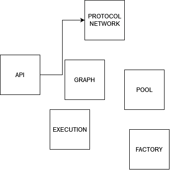

============
Architecture
============

We describe here the global architecture of a Massa Node. Each of the modules
described here runs inside one or more threads inside the massa node executable,
and exchange information internally.

- SVG

.. image:: architecture.drawio.svg

    
- PNG
  

