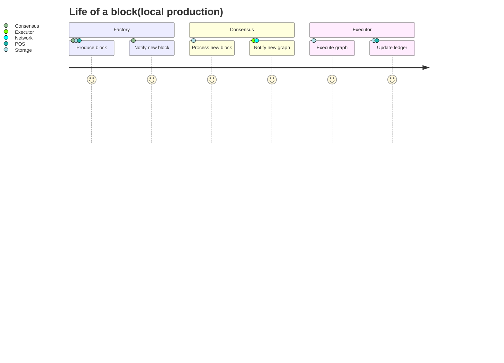
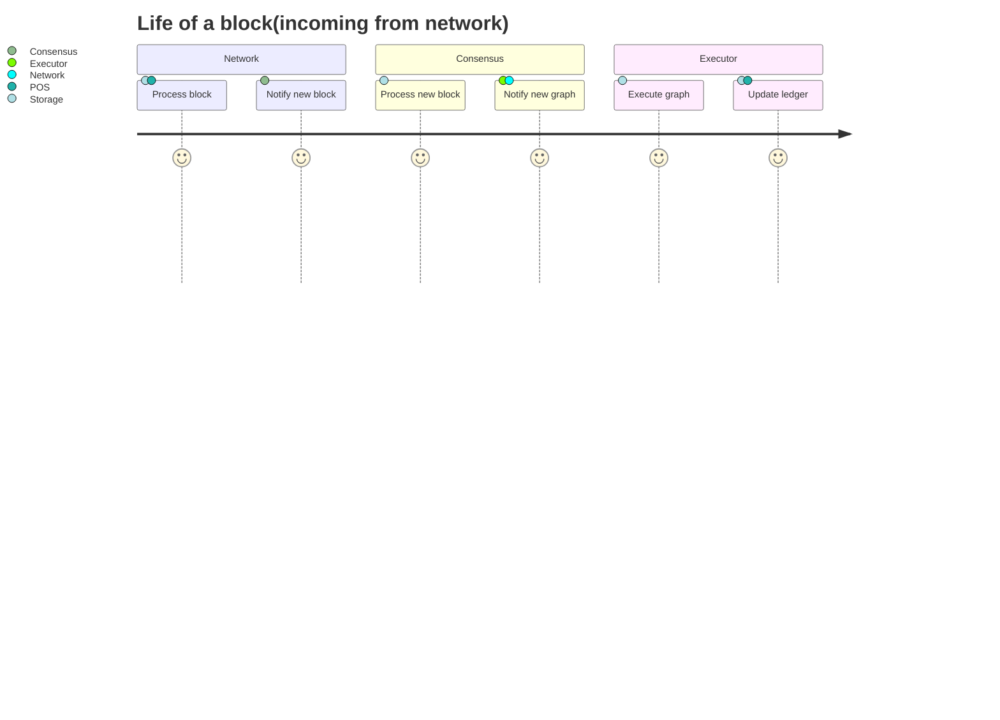

# Archicture of block processing

## Local production

### Factory

1. Produce block:
    - Get best parents from Consensus.
    - Get draws from POS
2. Notify new block:
    - Notify Consensus.
    
## Incoming from network

### Network

1. Process block:
    - Get draws from POS.
    - Read and write blocks, operations, endorsements, to Storage
2. Notify new block:
    - Notify Consensus

## Shared by both pipelines

### Consensus
1. Process new block:
    - Get new block from Storage.
    - Process with graph.
2. Notify new graph to Executor and Network(for progagation).

### Executor
1. Execute graph
    - Get blocks from Storage.
2. Update ledger/final blocks
    - Update storage
    - Notify POS.

