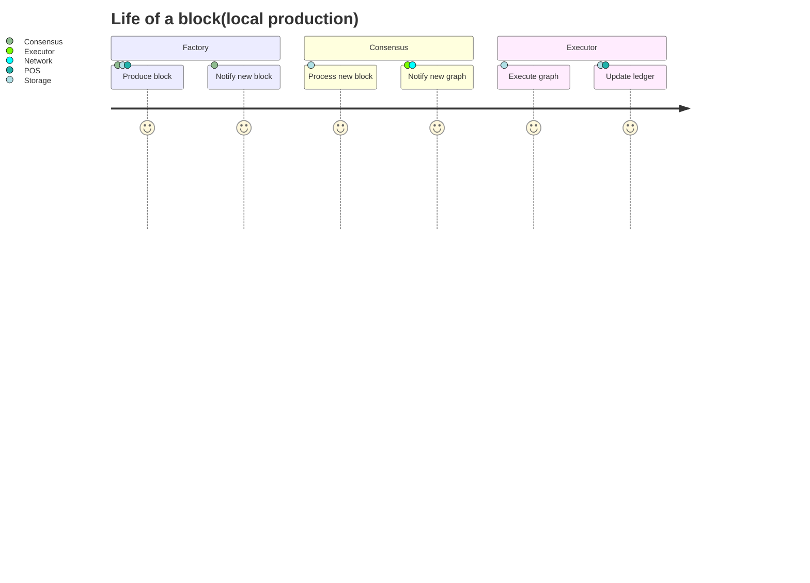
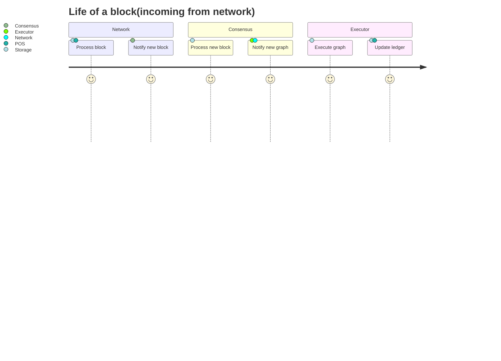

# Archicture of block processing

## Local production



### Factory

1. Produce block:
    - Get best parents from Consensus.
    - Get draws from POS
2. Notify new block:
    - Notify Consensus.
    
## Incoming from network



### Network

1. Process block:
    - Get draws from POS.
    - Read and write blocks, operations, endorsements, to Storage
2. Notify new block:
    - Notify Consensus

## Shared by both pipelines

### Consensus
1. Process new block:
    - Get new block from Storage.
    - Process with graph.
2. Notify new graph to Executor and Network(for progagation).

### Executor
1. Execute graph
    - Get blocks from Storage.
2. Update ledger/final blocks
    - Update storage
    - Notify POS.
    
## Shared data

### Various
1. Best parents(writer: Consensus)
2. Draws(writer: POS)
3. Ledger(writer: Executor)
4. Final blocks(writer: Executor)

### Storage
1. Blocks(writer: Network, Production)
2. Endorsements(writer: Network, Production)
3. Operations(writer: Network, Api)

## Notifications

1. Production to Consensus, on Blocks.
2. Network to Consensus, on Blocks.
3. Consensus to Network, Executor, on Graph.
3. Executor to POS, on ledger/final blocks.


### Shared data structure


## Shared data

```rust
/// Shared by all components, and `masssa-node`(to orchestrate shutdown).
pub struct SharedData {
    best_parents: Arc<(Condvar, RwLock<(BestParents, Shutdown)>)>,
    draws: Arc<(Condvar, RwLock<(Draws, Shutdown)>)>,
    storage: Arc<(Condvar, RwLock<(Storage, Shutdown)>)>,
    graph: Arc<(Condvar, RwLock<(Graph, Shutdown)>)>,
    slot: Arc<(Condvar, RwLock<(Slot, Shutdown)>)>,
}

/// Used to signal shutdown.
pub struct Shutdown(bool);
```

## Best parents

```rust
/// One writer(Consensus), one reader(Production).
pub struct BestParents(Vec<(BlockId, u64)>) 
```

## Draws
```rust
/// One writer(POS), two readers(Production and Network).
pub struct Draws(DrawCache) 
```

## Storage
```rust
/// Two writers(Production and Network), two readers(Consensus and Executor).
/// Production and Network both notify Consensus.
/// Executor accesses when necessary.
///
/// Note the nested locks(use small locks like parking_lot), 
/// allowing for parallelism for operating on different blocks.
pub struct Storage(Map<BlockId, Arc<RwLock<Block>>>)
```

## Graph
```rust
/// One writer(Consensus), one reader(Executor).
/// Consensus notifies Executor of changes. 
/// Executor also access Storage as necessary to obtain relevant blocks.
pub struct Graph(Mutex<Graph>)
```

## Structure of component execution(event-loops)

### Slot

Dedicated thread running a timer and writint the `Slot`, nofitying Factory on the condvar.

### Factory
Waits on a slot timer(and shutdown).

1. Wake-up at each slot
2. Read draws.
3. If drawn: read best parents and produce.
4. If produced, write to Storage, notify on condvar.

### Consensus
Waits on Storage(and shutdown).

1. Wake-up on the condvar
2. Read new block.
3. Process in graph.
4. Write to graph and notify on condvar.

### Executor
Waits on Graph(and shutdown)
1. Wake-up on the condvar
2. Read new graph.
3. Read blocks.
4. Execute operations.
5. Update ledger and final blocks.
6. Notify POS.

### Network(outgoing)
Waits on Graph(and shutdown)
1. Wake-up on the condvar
2. Read new graph.
3. Read blocks.
4. Propagate.

### Network(incoming)
Waits on Incoming(and shutdown)
1. Wake-up on the condvar
2. Read new data.
3. Deserialize into known objects, validate them.
4. Propagate.

Note: Should own a tokio runtime, running one task per peer, and those tasks will add incoming data to the shared Incoming data, and notify on the condvar. 

## A note on shutdown

In order to orchestrate shutdown, all shared object should include something representing a "shutdown" signal, which `massa-node` could use to request shutdown of all components, and then wait for the shutdown to have been completed. 
